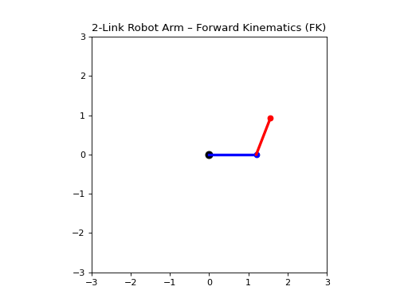

# 🤖 Forward & Inverse Kinematics — Intuitive + Mathematical Guide

This document explains **Forward Kinematics (FK)** and **Inverse Kinematics (IK)** for a simple **2-link planar robot arm**, using clear intuition first and math second.

---

## 📌 Robot Arm Model

A 2-link robotic arm:

- (base)── L1 ──(joint1)── L2 ──(joint2)── (end effector)
- θ1 θ2

- **L1, L2** → lengths of links
- **θ1** → rotation of the first link relative to the base
- **θ2** → rotation of the second link relative to the first link

⚠️ Key rule:  
**Every joint angle affects everything after it.**

---

## 🔹 Forward Kinematics (FK)

FK answers the question:

> “If I know the joint angles, where is the end effector?”

### Intuition
- Rotate **shoulder (θ1)** → entire arm rotates.
- Rotate **elbow (θ2)** → only the second segment moves.

### Math

Elbow position:
- x1 = L1 * cos(θ1)
- y1 = L1 * sin(θ1)

End effector:
- x2 = x1 + L2 * cos(θ1 + θ2)
- y2 = y1 + L2 * sin(θ1 + θ2)

Final form (most important idea):
- p_end = [cos(θ1)*L1 + cos(θ1 + θ2)*L2,
- sin(θ1)*L1 + sin(θ1 + θ2)*L2]

### Example
- L1 = 1.2
- L2 = 1.0
- θ1 = 45° = 0.7854 rad
- θ2 = 30° = 0.5236 rad

Plugging into formulas →
- End effector ≈ (1.57 , 1.41)

📌 FK = **easy, always one answer**.

---

## 🔹 Inverse Kinematics (IK)

IK answers the opposite question:

> “If I want the end effector at (x, y), what should θ1 and θ2 be?”

### Intuition
- The robot tries to reach a target point — like your hand reaching a cup.

### Important observations
- Some positions have **two solutions** (“elbow up” and “elbow down”)
- Some positions are **unreachable**
- If distance_to_target > L1 + L2 → impossible
- Some positions are **too close**
- If distance_to_target < |L1 − L2| → impossible

### Math (closed-form IK for 2-link arm)

Let:
- r = sqrt(x² + y²)

Angle for second joint:
- cosθ2 = (r² − L1² − L2²) / (2 * L1 * L2)
- θ2 = arccos(cosθ2) # two possible signs = two solutions

Angle for first joint:
- φ = atan2(y, x)
- ψ = atan2(L2sinθ2, L1 + L2cosθ2)
- θ1 = φ − ψ

📌 IK = **solves for θ1, θ2 from (x, y)**.  
Harder than FK because there may be:
- multiple solutions,
- no solution,
- or solutions beyond joint limits.

---

## 🤯 FK vs IK — summary table

| Task | Input | Output | Difficulty | Notes |
|------|-------|--------|------------|-------|
| FK | θ1, θ2 | (x, y) | ⭐ Easy | Direct formulas |
| IK | (x, y) | θ1, θ2 | 🔥 Hard | Multiple or no solutions |

---

## 🧠 Real Robotics Meaning

| Robot subsystem | Needs frame |
|-----------------|-------------|
| Motors | FK |
| Motion planning | IK |
| Grasping target | IK |
| Collision-free path planning | IK + FK |
| SLAM / Mapping / Control | FK inside TF tree |

Example:
- Camera detects an object → IK to find joint angles → FK to move step by step along trajectory.

---

# 🎯 2-Link Robot Arm — Moving Target IK Tracking (Simulation)

This project builds an interactive 2D simulation of a **2-link robotic arm** that uses **Inverse Kinematics (IK)** to reach a **continuously changing target**.  
Every few seconds the target randomly jumps to a new reachable location, and the arm **smoothly adjusts its joint angles** to reach it.

This is not just animation — it demonstrates **how real robots track goals using IK and joint-space control**.

---

## 🔥 What this simulation teaches

| Concept | What you learn |
|--------|----------------|
| Forward Kinematics | How joint angles → end-effector position |
| Inverse Kinematics | How target position → required joint angles |
| Reachability | Workspace constraints of a 2-link arm |
| Target tracking | Continuous IK updates → smooth motion |
| Joint-space interpolation | No jerky movements — like real robot controllers |

---

## 🧠 Robot Arm Details

- Link 1 length: **1.2**
- Link 2 length: **1.0**
- Uses **analytic IK** (not numerical)
- **Elbow-up configuration**
- Target point changes automatically during the animation

---

## 🚀 How the simulation works

1. Sample a **random reachable point** within the arm’s workspace  
2. Apply **Inverse Kinematics** to compute joint angles `(θ1, θ2)` needed to reach it  
3. Move the arm **smoothly** toward these angles using:
- θ_current += α × (θ_target − θ_current)
4. After a fixed number of frames, step 1 repeats → new target generated  
5. The arm continues chasing each new target

This is exactly how **robot arms track moving objects in the real world**.

---

## 📌 Key Formulas

### Forward Kinematics (FK)
```text
x1 = L1 cos(θ1)
y1 = L1 sin(θ1)

x2 = x1 + L2 cos(θ1 + θ2)
y2 = y1 + L2 sin(θ1 + θ2)
```

### Inverse Kinematics (IK)
```text
cosθ2 = (x² + y² − L1² − L2²) / (2 L1 L2)
θ2 = acos(cosθ2)
θ1 = atan2(y, x) − atan2(L2 sinθ2, L1 + L2 cosθ2)
```

---

📂 Project Structure

- `sim_fk.py` : Forward kinematics simulation
- `sim_ik_reach_dynamic_target.py`: Main script for the simulation
- `sim_ik_reach_dynamic_target_loop.py`: Loop-based version of the simulation
- `README.md`: Project documentation

---

## 🎥 Simulation Preview GIFs

Forward Kinematics (`sim_fk.py`)


IK — Reach a single random target (`sim_ik_reach_dynamic_target.py`)
 |

IK — Continuous dynamic target tracking (`sim_ik_reach_dynamic_target_loop.py`)
 |

---

## 📌 Running the Simulation

To run the simulation, execute the following command in the terminal:

```bash
python sim_fk.py
```
This will start the simulation and display the 2-link robotic arm reaching a target.

```bash
python sim_ik_reach_dynamic_target.py
```
This will start the simulation and display the 2-link robotic arm reaching a dynamically changing target.

```bash
python sim_ik_reach_dynamic_target_loop.py
```
This will start the simulation and display the 2-link robotic arm reaching a dynamically changing target using a loop-based approach.

---

## 📌 What I personally learned from this project

- How kinematics moves from equations → animation → real robot meaning
- How FK is used to predict motion
- How IK is used to reach and track objects
- How robots avoid “jumping” using joint-space interpolation
- Why some targets are unreachable due to workspace limits
- Why IK is fundamental for:
  - Object grasping
  - Manipulation
  - Human-robot collaboration
  - Motion planning (MoveIt, OMPL)
  - Humanoid & industrial arm control

## 📌 Notes

- The simulation uses a simple random target generation algorithm.
- The inverse kinematics function is implemented using closed-form equations.
- The simulation uses a simple joint-space interpolation algorithm to move the arm smoothly towards the target.
- The simulation is designed to be interactive, allowing the user to adjust parameters and observe the effects on the arm's behavior.

---
